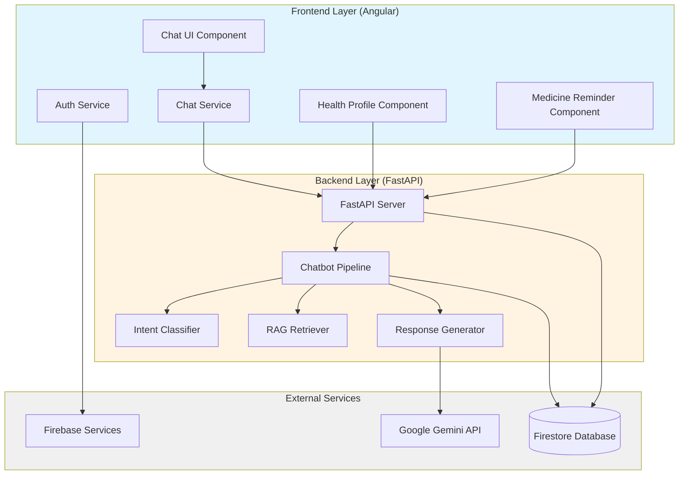
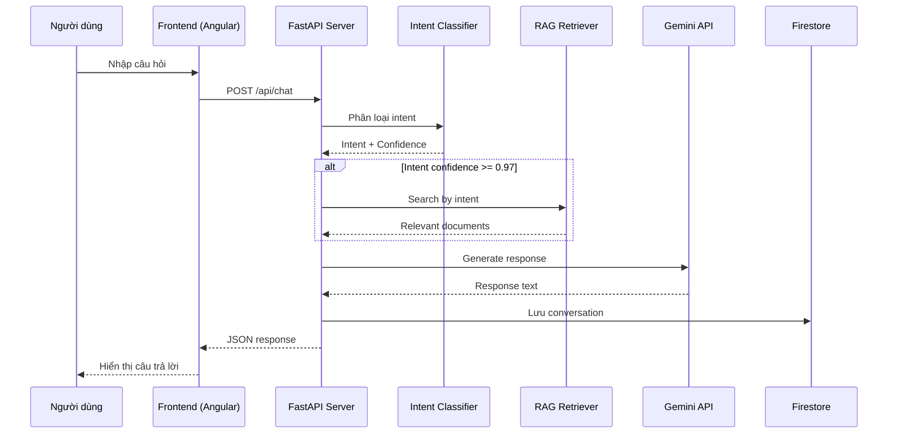
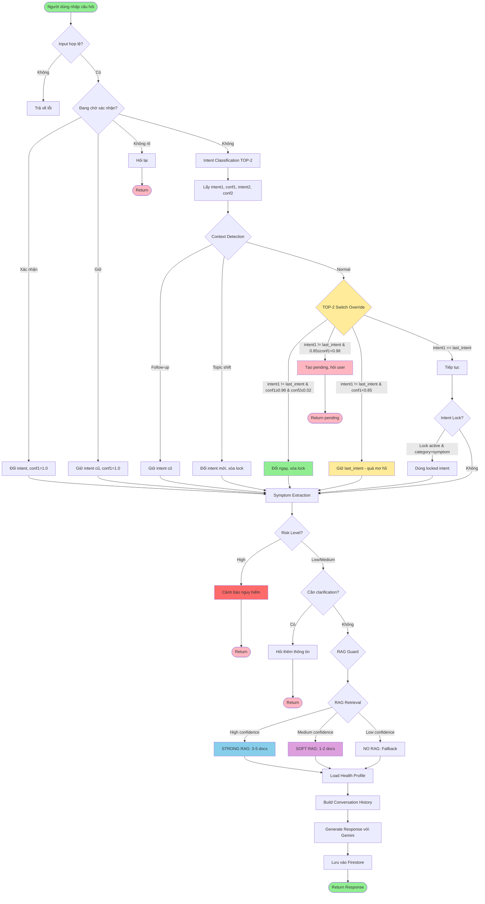
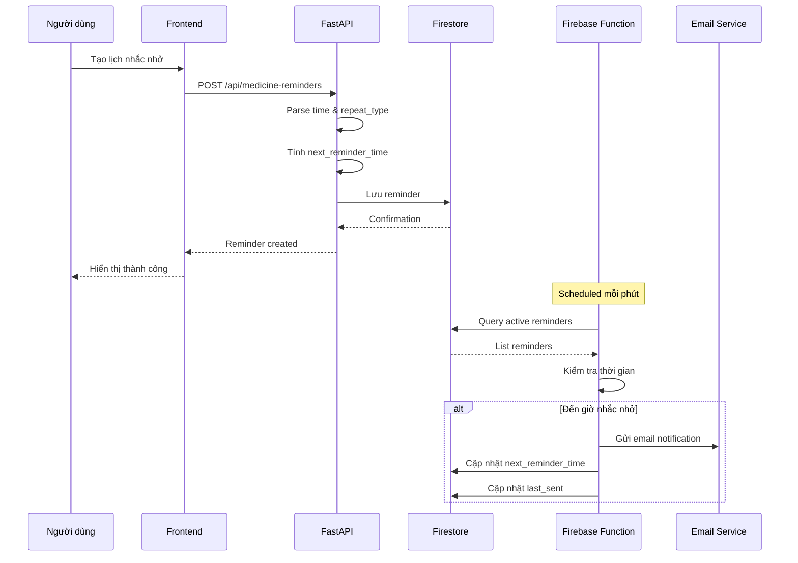
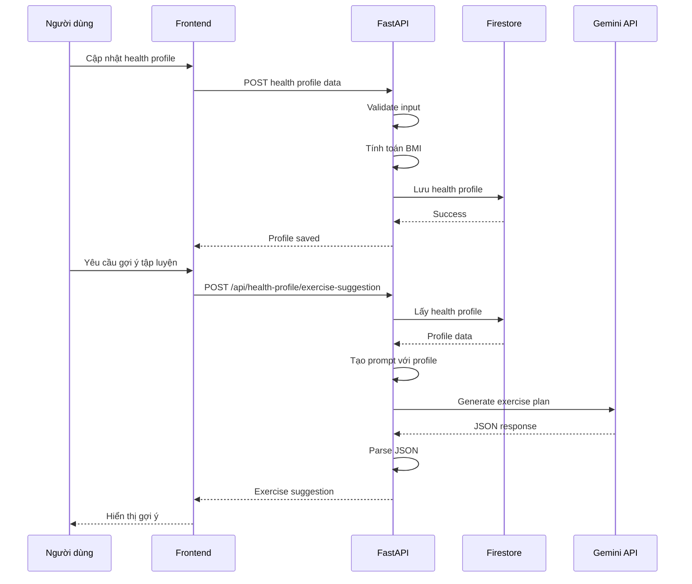
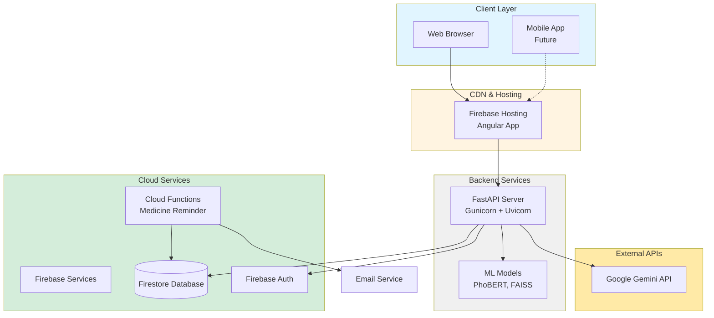

# BÁO CÁO CHI TIẾT DỰ ÁN CHATBOT Y TẾ

## MỤC LỤC

1. [Tổng quan dự án](#1-tổng-quan-dự-án)
2. [Kiến trúc hệ thống](#2-kiến-trúc-hệ-thống)
3. [Công nghệ sử dụng](#3-công-nghệ-sử-dụng)
4. [Chức năng chính](#4-chức-năng-chính)
5. [Luồng xử lý](#5-luồng-xử-lý)
6. [Cấu trúc dự án](#6-cấu-trúc-dự-án)
7. [Hướng dẫn cài đặt và triển khai](#7-hướng-dẫn-cài-đặt-và-triển-khai)
8. [API Documentation](#8-api-documentation)
9. [Kết quả và đánh giá](#9-kết-quả-và-đánh-giá)
10. [Hướng phát triển](#10-hướng-phát-triển)
11. [Kết luận](#11-kết-luận)

---

## 1. TỔNG QUAN DỰ ÁN

### 1.1. Giới thiệu

Dự án **Chatbot Y Tế** là một hệ thống trợ lý y tế thông minh được xây dựng để hỗ trợ người dùng trong việc:
- Tư vấn sức khỏe ban đầu
- Nhắc nhở uống thuốc
- Quản lý hồ sơ sức khỏe cá nhân
- Cung cấp thông tin y tế chính xác và an toàn

### 1.2. Mục tiêu

- **Tư vấn y tế thông minh**: Sử dụng AI để phân loại ý định người dùng và cung cấp thông tin y tế phù hợp
- **An toàn và chính xác**: Luôn ưu tiên an toàn, không chẩn đoán bệnh, khuyến khích người dùng gặp bác sĩ khi cần
- **Trải nghiệm người dùng tốt**: Giao diện thân thiện, dễ sử dụng, hỗ trợ đa nền tảng
- **Quản lý sức khỏe cá nhân**: Theo dõi hồ sơ sức khỏe và nhắc nhở uống thuốc

### 1.3. Đối tượng sử dụng

- Người dùng cá nhân cần tư vấn sức khỏe ban đầu
- Người dùng cần nhắc nhở uống thuốc định kỳ
- Người dùng muốn quản lý hồ sơ sức khỏe cá nhân

### 1.4. Phạm vi, giả định và ràng buộc

Hệ thống tập trung vào hỗ trợ tư vấn sức khỏe ban đầu, định hướng người dùng và cung cấp khuyến nghị an toàn dựa trên dữ liệu đã xây dựng. Chatbot không thay thế bác sĩ, không chẩn đoán bệnh và không đưa ra chỉ định điều trị.

Giả định triển khai: người dùng có kết nối Internet ổn định; dữ liệu người dùng nhập có độ chính xác tương đối; các dịch vụ nền tảng (Firebase, Gemini API) hoạt động bình thường trong thời gian sử dụng.

Ràng buộc kỹ thuật: chất lượng câu trả lời phụ thuộc vào độ bao phủ của cơ sở tri thức và độ chính xác của mô hình intent; hệ thống phụ thuộc vào quota/độ trễ của dịch vụ tạo sinh (Gemini); dữ liệu nhạy cảm cần được kiểm soát truy cập theo từng người dùng.

---

## 2. KIẾN TRÚC HỆ THỐNG

### 2.1. Kiến trúc tổng quan

Hệ thống được xây dựng theo kiến trúc **Client-Server** với 3 tầng chính:

```
┌─────────────────────────────────────────────────────────┐
│                    FRONTEND (Angular)                    │
│  - Giao diện người dùng                                  │
│  - Quản lý phiên đăng nhập                               │
│  - Tích hợp Firebase Authentication                     │
└──────────────────────┬──────────────────────────────────┘
                       │ HTTP/REST API
┌──────────────────────┴──────────────────────────────────┐
│                 BACKEND (FastAPI)                         │
│  - Intent Classification (PhoBERT)                        │
│  - RAG Retrieval (FAISS + SentenceTransformer)           │
│  - Response Generation (Google Gemini API)               │
│  - Business Logic                                        │
└──────────────────────┬──────────────────────────────────┘
                       │
┌──────────────────────┴──────────────────────────────────┐
│              DATABASE & SERVICES                          │
│  - Firebase Firestore (Lưu trữ dữ liệu)                  │
│  - Firebase Authentication (Xác thực)                     │
│  - Firebase Functions (Cloud Functions)                  │
└──────────────────────────────────────────────────────────┘
```

### 2.2. Biểu đồ Component

Biểu đồ Component mô tả các thành phần chính và mối quan hệ giữa chúng:



### 2.3. Luồng dữ liệu

1. **Người dùng nhập câu hỏi** → Frontend gửi request đến Backend
2. **Backend xử lý**:
   - Intent Classification: Phân loại ý định người dùng
   - RAG Retrieval: Tìm kiếm thông tin liên quan trong database
   - Response Generation: Tạo câu trả lời bằng Gemini API
3. **Backend trả về response** → Frontend hiển thị cho người dùng
4. **Lưu trữ**: Cuộc trò chuyện được lưu vào Firestore

### 2.4. Biểu đồ Sequence - Luồng Chat

Biểu đồ Sequence mô tả luồng tương tác khi người dùng chat với hệ thống:



### 2.5. Các thành phần chính

#### 2.5.1. Intent Classifier
- **Mô hình**: PhoBERT (Vietnamese BERT)
- **Chức năng**: Phân loại ý định người dùng thành các nhóm:
  - `bao_dau_bung`: Báo đau bụng
  - `bao_dau_dau`: Báo đau đầu
  - `bao_ho`: Báo ho
  - `bao_met_moi`: Báo mệt mỏi
  - `bao_sot`: Báo sốt
  - `lo_lang_stress`: Lo lắng, stress
  - `tu_van_dinh_duong`: Tư vấn dinh dưỡng
  - `tu_van_tap_luyen`: Tư vấn tập luyện
  - `other`: Khác

#### 2.5.2. RAG Retriever
- **Embedding Model**: `keepitreal/vietnamese-sbert`
- **Vector Database**: FAISS
- **Chức năng**: Tìm kiếm thông tin y tế liên quan từ database dựa trên câu hỏi của người dùng

#### 2.5.3. Response Generator
- **API**: Google Gemini API (gemini-2.5-flash)
- **Chức năng**: Tạo câu trả lời y tế dựa trên:
  - Thông tin từ RAG
  - Lịch sử cuộc trò chuyện
  - Hồ sơ sức khỏe người dùng (nếu có)

---

## 3. CÔNG NGHỆ SỬ DỤNG

### 3.1. Backend

| Công nghệ | Phiên bản | Mục đích |
|-----------|-----------|----------|
| Python | 3.10+ | Ngôn ngữ lập trình chính |
| FastAPI | >=0.104.0 | Framework web API |
| PyTorch | >=2.0.0 | Deep learning framework |
| Transformers | >=4.35.0 | NLP models (PhoBERT) |
| SentenceTransformers | >=2.2.0 | Embedding models |
| FAISS | >=1.7.4 | Vector similarity search |
| Google Generative AI | >=0.3.0 | Gemini API client |
| Firebase Admin SDK | >=6.0.0 | Firebase integration |

### 3.2. Frontend

| Công nghệ | Phiên bản | Mục đích |
|-----------|-----------|----------|
| Angular | 15.2.0 | Framework frontend |
| TypeScript | ~4.9.4 | Ngôn ngữ lập trình |
| Firebase | ^12.6.0 | Authentication & Firestore |
| AngularFire | ^7.6.1 | Angular Firebase integration |
| RxJS | ~7.8.0 | Reactive programming |

### 3.3. Infrastructure

| Công nghệ | Mục đích |
|-----------|----------|
| Firebase Authentication | Xác thực người dùng |
| Firebase Firestore | Database NoSQL |
| Firebase Functions | Cloud Functions (nhắc nhở thuốc) |
| Google Gemini API | AI text generation |

---

## 4. CHỨC NĂNG CHÍNH

### 4.1. Chat với AI

#### 4.1.1. Phân loại ý định thông minh
- Tự động nhận diện ý định người dùng
- Xử lý follow-up questions (câu hỏi tiếp theo)
- Phát hiện topic shift (chuyển chủ đề)
- Intent lock mechanism (ổn định intent trong vài lượt)

#### 4.1.2. RAG (Retrieval-Augmented Generation)
- Tìm kiếm thông tin y tế từ database
- Phân loại RAG mode:
  - **STRONG RAG**: Confidence >= 0.7 → Dùng 3-5 đoạn
  - **SOFT RAG**: Confidence >= 0.5 → Dùng 1-2 đoạn (tham khảo)
  - **NO RAG**: Confidence < 0.5 → Fallback Gemini
- **Lưu ý**: Các ngưỡng RAG (0.97, 0.85, 0.7, 0.5) có thể được cấu hình linh hoạt tùy theo yêu cầu triển khai và đặc thù dữ liệu

#### 4.1.3. Response Generation
- Sử dụng Google Gemini API để tạo câu trả lời
- Tích hợp lịch sử cuộc trò chuyện (GPT-like context)
- Tích hợp hồ sơ sức khỏe người dùng
- Tách bạch thông tin người dùng và kiến thức y tế

#### 4.1.4. Safety Layer
- **Risk Estimation**: Phát hiện dấu hiệu nguy hiểm
- **Clarification**: Hỏi thêm khi cần thông tin rõ ràng hơn
- **Safety Recommendations**: Khuyến khích gặp bác sĩ khi cần

### 4.2. Nhắc nhở uống thuốc

#### 4.2.1. Tạo lịch nhắc nhở
- Nhập tên thuốc, thời gian uống
- Chọn loại lặp lại:
  - **Daily**: Hàng ngày
  - **Weekly**: Hàng tuần (chọn ngày trong tuần)
  - **Once**: Một lần
- Thêm ghi chú (nếu có)

#### 4.2.2. Quản lý lịch nhắc nhở
- Xem danh sách tất cả lịch nhắc nhở
- Xóa lịch nhắc nhở
- Tự động gửi thông báo qua email (Firebase Functions)

### 4.3. Hồ sơ sức khỏe

#### 4.3.1. Thông tin cơ bản
- Tuổi
- Giới tính
- Chiều cao
- Cân nặng
- Mức vận động (Ít/Vừa/Nhiều)

#### 4.3.2. Tính toán BMI
- Tự động tính BMI từ chiều cao và cân nặng
- Phân loại BMI:
  - < 18.5: Hơi gầy
  - 18.5 - 25: Cân đối
  - 25 - 30: Hơi thừa cân
  - >= 30: Thừa cân nhiều

#### 4.3.3. Gợi ý tập luyện
- Tự động tạo gợi ý tập luyện dựa trên hồ sơ sức khỏe
- Sử dụng Gemini API để tạo kế hoạch tập luyện chi tiết
- Bao gồm: bài tập, tần suất, thời gian, lưu ý

### 4.4. Xác thực và bảo mật

#### 4.4.1. Firebase Authentication
- Đăng ký tài khoản
- Đăng nhập
- Quên mật khẩu
- Đổi mật khẩu

#### 4.4.2. Bảo mật dữ liệu
- Mỗi người dùng chỉ xem được dữ liệu của mình
- Firestore Security Rules
- CORS middleware

### 4.5. Quản trị viên

- Xem danh sách người dùng
- Xem lịch sử chat của người dùng
- Quản lý hệ thống

#### 4.5.1. Phân quyền quản trị viên

Tài khoản quản trị viên có quyền xem danh sách người dùng và thống kê mức sử dụng hệ thống nhằm phục vụ vận hành. Việc truy cập lịch sử chat của người dùng (nếu có) cần được giới hạn theo mục đích quản trị và tuân thủ nguyên tắc bảo mật dữ liệu. Các thao tác quản trị quan trọng (xem dữ liệu, thay đổi cấu hình) nên được ghi nhận để phục vụ kiểm tra và truy vết khi cần.

### 4.6. Quy tắc an toàn dữ liệu và quyền riêng tư

Hệ thống áp dụng nguyên tắc tối thiểu quyền (least privilege) trong truy cập dữ liệu. Mỗi người dùng chỉ được đọc/ghi các tài nguyên thuộc về tài khoản của mình. Dữ liệu chat và hồ sơ sức khỏe được lưu theo user_id để phục vụ cá nhân hóa, đồng thời giới hạn quyền truy cập bằng Firestore Security Rules.

Khi gọi dịch vụ tạo sinh, hệ thống chỉ gửi các thông tin cần thiết cho việc sinh phản hồi (câu hỏi hiện tại, một phần lịch sử hội thoại có chọn lọc, và hồ sơ sức khỏe nếu người dùng cho phép). Các thông tin định danh nhạy cảm (ví dụ: email) không được đưa trực tiếp vào prompt nếu không cần thiết. Log hệ thống cần hạn chế lưu nội dung nhạy cảm và chỉ phục vụ mục đích debug trong phạm vi cho phép.

### 4.7. Biểu đồ Use Case

Biểu đồ Use Case mô tả các chức năng chính của hệ thống và người dùng tương tác:

```mermaid
graph TB
    User[Người dùng] --> UC1[Chat với AI]
    User --> UC2[Đăng ký/Đăng nhập]
    User --> UC3[Quản lý hồ sơ sức khỏe]
    User --> UC4[Tạo lịch nhắc nhở thuốc]
    User --> UC5[Xem lịch nhắc nhở]
    User --> UC6[Xóa lịch nhắc nhở]
    User --> UC7[Yêu cầu gợi ý tập luyện]
    
    Admin[Quản trị viên] --> UC8[Xem danh sách người dùng]
    Admin --> UC9[Xem lịch sử chat]
    Admin --> UC10[Quản lý hệ thống]
    
    System[Hệ thống] --> UC11[Gửi thông báo nhắc nhở]
    System --> UC12[Lưu trữ dữ liệu]
    
    style User fill:#e1f5ff
    style Admin fill:#fff4e1
    style System fill:#f0f0f0
```



---

## 5. LUỒNG XỬ LÝ

### 5.1. Luồng xử lý chat

```
User Input
    ↓
[1] Input Validation
    ↓
[2] Pending Flow (nếu đang chờ xác nhận đổi chủ đề)
    ├─→ User xác nhận? → Đổi intent, reset conf1 = 1.0
    ├─→ User giữ? → Giữ intent cũ, reset conf1 = 1.0
    └─→ Không rõ? → Hỏi lại
    ↓
[3] Intent Classification (TOP-2 PhoBERT)
    ├─→ intent1, conf1 (highest)
    └─→ intent2, conf2 (second highest)
    ↓
[4] Context Detection
    ├─→ Follow-up? → Giữ intent cũ
    ├─→ Topic shift? → Đổi intent mới, xóa lock
    └─→ Normal → Tiếp tục đến TOP-2 Switch
    ↓
[5] TOP-2 Switch Override (TRƯỚC intent_lock)
    ├─→ intent1 != last_intent?
    │   ├─→ conf1 >= 0.98 & conf2 <= 0.02 → Đổi ngay, xóa lock
    │   ├─→ 0.85 <= conf1 < 0.98 → Tạo pending hỏi xác nhận
    │   └─→ conf1 < 0.85 → Giữ last_intent (quá mơ hồ)
    └─→ intent1 == last_intent → Tiếp tục
    ↓
[6] Intent Lock Check (chỉ nếu không bị TOP-2 override)
    ├─→ Lock active & final_intent == last_intent?
    ├─→ intent_category == "symptom"?
    └─→ Dùng locked intent
    ↓
[7] Symptom Extraction
    ↓
[8] Risk Estimation
    ├─→ High risk? → Cảnh báo + Return
    └─→ Low/Medium → Tiếp tục
    ↓
[9] Clarification Check
    ├─→ Cần clarification? → Hỏi thêm + Return
    └─→ No need → Tiếp tục
    ↓
[10] RAG Guard
    ├─→ Follow-up? → Dùng intent cũ cho RAG
    └─→ Normal → Dùng intent hiện tại
    ↓
[11] RAG Retrieval
    ├─→ intent_category == "no_rag"? → Skip RAG
    ├─→ conf1 >= 0.98? → Search by intent (STRONG)
    ├─→ conf1 >= 0.85? → Global search (nếu intent không đổi)
    └─→ Otherwise → No RAG
    ↓
[12] RAG Gate Logic
    ├─→ RAG confidence >= strong_threshold? → STRONG RAG (3-5 docs)
    ├─→ RAG confidence >= soft_threshold? → SOFT RAG (1-2 docs)
    └─→ Otherwise → NO RAG
    ↓
[13] Load Health Profile (nếu có user_id)
    ↓
[14] Build Conversation History
    ↓
[15] Generate Response
    ├─→ Use RAG? → Generate với RAG context
    └─→ No RAG? → Generate với Gemini tự do
    ↓
[16] Return Response
```

#### 5.1.1. Biểu đồ Activity - Luồng xử lý Chat

Biểu đồ Activity mô tả chi tiết luồng xử lý chat với TOP-2 decision:



### 5.2. Luồng xử lý nhắc nhở thuốc

```
User tạo reminder
    ↓
[1] Parse time và repeat_type
    ↓
[2] Tính toán next_reminder_time
    ↓
[3] Lưu vào Firestore
    ↓
[4] Firebase Function (scheduled)
    ├─→ Kiểm tra reminders mỗi phút
    ├─→ Đến giờ? → Gửi email notification
    └─→ Cập nhật next_reminder_time
```

#### 5.2.1. Biểu đồ Sequence - Nhắc nhở thuốc



### 5.3. Luồng xử lý hồ sơ sức khỏe

```
User cập nhật health profile
    ↓
[1] Validate input
    ↓
[2] Tính toán BMI
    ↓
[3] Lưu vào Firestore
    ↓
[4] User yêu cầu exercise suggestion
    ↓
[5] Backend gọi Gemini API
    ├─→ Tạo prompt với health profile
    └─→ Generate exercise plan (JSON)
    ↓
[6] Parse JSON response
    ↓
[7] Return exercise suggestion
```

#### 5.3.1. Biểu đồ Sequence - Hồ sơ sức khỏe



---

## 6. CẤU TRÚC DỰ ÁN

### 6.1. Backend Structure

```
CHAT BOT TTCS/
├── api_server.py                 # FastAPI server chính
├── chatbot.py                    # Chat pipeline logic
├── requirements.txt              # Python dependencies
├── firestore_service.py          # Firebase Firestore service
├── medicine_reminder_scheduler.py # Medicine reminder scheduler
│
├── app/                          # Application logic
│   ├── intent_router.py          # Intent routing logic
│   ├── medicine_time_parser.py   # Parse medicine time
│   ├── response_layer.py         # Response layer logic
│   ├── risk_estimator.py         # Risk estimation
│   └── symptom_extractor.py      # Symptom extraction
│
├── intent/                       # Intent classification
│   └── intent_classifier.py      # PhoBERT intent classifier
│
├── rag/                          # RAG retrieval
│   └── retriever.py              # FAISS retriever
│
├── generator/                    # Response generation
│   ├── gemini_generator.py       # Google Gemini API
│   └── gemma_generator.py        # Gemma local (deprecated)
│
├── model/                        # Trained models
│   └── intent_model/             # PhoBERT intent model
│
├── data/                         # Training data
│   ├── bao_dau_bung.txt
│   ├── bao_dau_dau.txt
│   ├── bao_ho.txt
│   ├── bao_met_moi.txt
│   ├── bao_sot.txt
│   ├── lo_lang_stress.txt
│   ├── tu_van_dinh_duong.txt
│   └── tu_van_tap_luyen.txt
│
└── embeddings/                   # FAISS indexes
    ├── bao_dau_bung_index.faiss
    ├── bao_dau_bung_docs.pkl
    ├── ...
```

### 6.3. Frontend Structure

```
AI-Web/
├── src/
│   ├── app/
│   │   ├── chat-ui/              # Chat interface
│   │   ├── login/                # Login page
│   │   ├── register/             # Register page
│   │   ├── settings/             # Settings page
│   │   ├── medicine-reminder/    # Medicine reminder
│   │   ├── health-profile/       # Health profile
│   │   ├── admin/                # Admin panel
│   │   ├── services/             # Angular services
│   │   │   ├── chat.service.ts
│   │   │   ├── auth.service.ts
│   │   │   └── ...
│   │   └── guards/               # Route guards
│   │       └── admin.guard.ts
│   │
│   ├── environments/             # Environment configs
│   │   ├── environment.ts
│   │   ├── environment.prod.ts
│   │   └── firebase.config.ts
│   │
│   └── assets/                   # Static assets
│
├── functions/                    # Firebase Functions
│   ├── src/
│   │   └── index.ts              # Cloud Functions
│   └── package.json
│
├── firebase.json                 # Firebase config
├── firestore.rules               # Firestore security rules
└── package.json                  # Dependencies
```

---

## 7. HƯỚNG DẪN CÀI ĐẶT VÀ TRIỂN KHAI

### 7.1. Yêu cầu hệ thống

#### Backend
- Python 3.10+
- RAM: Tối thiểu 8GB (khuyến nghị 16GB)
- Disk: Tối thiểu 5GB (cho models và data)
- GPU: Không bắt buộc (có thể chạy trên CPU)

#### Frontend
- Node.js 16+
- npm hoặc yarn
- Angular CLI 15+

### 7.2. Cài đặt Backend

#### Bước 1: Clone repository
```bash
git clone <repository-url>
cd "CHAT BOT TTCS"
```

#### Bước 2: Tạo virtual environment
```bash
python -m venv venv
# Windows
venv\Scripts\activate
# Linux/Mac
source venv/bin/activate
```

#### Bước 3: Cài đặt dependencies
```bash
pip install -r requirements.txt
```

#### Bước 4: Cấu hình môi trường
Tạo file `.env` hoặc set environment variables:
```bash
# Gemini API Key
export GEMINI_API_KEY="your-api-key-here"

# Gemini Model (optional, default: gemini-2.5-flash)
export GEMINI_MODEL="gemini-2.5-flash"

# Firebase Service Account (nếu dùng Firestore từ backend)
export GOOGLE_APPLICATION_CREDENTIALS="path/to/service-account-key.json"

# CORS Origins (optional, default: *)
export ALLOWED_ORIGINS="http://localhost:4200,https://your-domain.com"
```

#### Bước 5: Khởi động server
```bash
# Windows
python api_server.py
# hoặc
uvicorn api_server:app --reload --port 8000

# Linux/Mac
python3 api_server.py
# hoặc
uvicorn api_server:app --reload --port 8000
```

Server sẽ chạy tại `http://localhost:8000`

### 7.3. Cài đặt Frontend

#### Bước 1: Di chuyển vào thư mục frontend
```bash
cd AI-Web
```

#### Bước 2: Cài đặt dependencies
```bash
npm install
# hoặc
yarn install
```

#### Bước 3: Cấu hình Firebase
Chỉnh sửa `src/environments/firebase.config.ts`:
```typescript
export const firebaseConfig = {
  apiKey: "your-api-key",
  authDomain: "your-project.firebaseapp.com",
  projectId: "your-project-id",
  storageBucket: "your-project.appspot.com",
  messagingSenderId: "your-sender-id",
  appId: "your-app-id"
};
```

#### Bước 4: Cấu hình API endpoint
Chỉnh sửa `src/environments/environment.ts`:
```typescript
export const environment = {
  production: false,
  apiUrl: 'http://localhost:8000'
};
```

#### Bước 5: Khởi động development server
```bash
ng serve
# hoặc
npm start
```

Frontend sẽ chạy tại `http://localhost:4200`

### 7.4. Triển khai Production

#### Backend (FastAPI)
1. **Sử dụng Gunicorn + Uvicorn**:
```bash
pip install gunicorn
gunicorn api_server:app -w 4 -k uvicorn.workers.UvicornWorker --bind 0.0.0.0:8000
```

2. **Sử dụng Docker** (khuyến nghị):
```dockerfile
FROM python:3.9-slim
WORKDIR /app
COPY requirements.txt .
RUN pip install -r requirements.txt
COPY . .
CMD ["uvicorn", "api_server:app", "--host", "0.0.0.0", "--port", "8000"]
```

#### Frontend (Angular)
1. **Build production**:
```bash
ng build --configuration production
```

2. **Deploy lên Firebase Hosting**:
```bash
firebase deploy --only hosting
```

3. **Hoặc deploy lên server khác**:
- Copy thư mục `dist/` lên web server (Nginx, Apache, etc.)

#### Firebase Functions (Medicine Reminder)
```bash
cd AI-Web/functions
npm install
firebase deploy --only functions
```

#### 7.4.1. Biểu đồ Deployment

Biểu đồ Deployment mô tả kiến trúc triển khai hệ thống:



### 7.5. Cấu hình và vận hành hệ thống

Trong vận hành thực tế, hệ thống cần cấu hình giới hạn CORS theo domain triển khai, bật cơ chế rate limit cho endpoint chat để tránh lạm dụng, và theo dõi thời gian phản hồi theo từng bước xử lý. Ngoài ra, cần có cơ chế xử lý lỗi khi dịch vụ tạo sinh không phản hồi hoặc vượt giới hạn quota, đảm bảo hệ thống vẫn trả về thông báo phù hợp cho người dùng.

---

## 8. API DOCUMENTATION

### 8.1. Base URL
```
http://localhost:8000
```

### 8.2. Endpoints

#### 8.2.1. Health Check

**GET** `/health`

Kiểm tra trạng thái server.

**Response:**
```json
{
  "status": "ok"
}
```

#### 8.2.2. Ready Check

**GET** `/ready`

Kiểm tra xem models đã load xong chưa.

**Response:**
```json
{
  "ready": true,
  "status": "Models đã sẵn sàng",
  "error": null
}
```

#### 8.2.3. Chat

**POST** `/api/chat`

Gửi tin nhắn đến chatbot.

**Request Body:**
```json
{
  "message": "Tôi bị đau đầu",
  "session_id": "optional-session-id",
  "user_id": "optional-user-id",
  "user_email": "optional-user-email"
}
```

**Response:**
```json
{
  "session_id": "session-id",
  "reply": "Câu trả lời từ chatbot...",
  "intent": "bao_dau_dau",
  "intent_confidence": 0.95,
  "symptoms": {
    "location": "đầu",
    "intensity": "trung bình"
  },
  "risk": "low",
  "clarification_needed": false,
  "clarification_question": null,
  "sources": [
    {
      "text": "Thông tin y tế...",
      "cosine": 0.85,
      "confidence": 0.92
    }
  ],
  "stage": "rag_high_confidence"
}
```

**Response Stages:**
- `validation`: Input validation
- `pending_confirm`: Đang chờ xác nhận đổi chủ đề
- `intent_switch_confirm`: Xác nhận chuyển chủ đề
- `clarification`: Cần làm rõ thông tin
- `safety`: Phát hiện nguy hiểm
- `rag_high_confidence`: Dùng RAG với confidence cao
- `gemini_fallback`: Fallback về Gemini

#### 8.2.4. Reset Conversation

**POST** `/api/chat/reset`

Reset cuộc trò chuyện.

**Request Body:**
```json
{
  "session_id": "session-id"
}
```

**Response:**
```json
{
  "session_id": "session-id",
  "status": "reset"
}
```

#### 8.2.5. Create Medicine Reminder

**POST** `/api/medicine-reminders`

Tạo lịch nhắc nhở uống thuốc.

**Request Body:**
```json
{
  "user_id": "user-id",
  "user_email": "user@example.com",
  "medicine_name": "Paracetamol",
  "time": "08:00",
  "repeat_type": "daily",
  "weekday": null,
  "start_date": "2024-01-01",
  "end_date": null,
  "notes": "Uống sau khi ăn"
}
```

**Response:**
```json
{
  "id": "reminder-id",
  "user_id": "user-id",
  "medicine_name": "Paracetamol",
  "time": "08:00",
  "repeat_type": "daily",
  "weekday": null,
  "start_date": "2024-01-01",
  "end_date": null,
  "notes": "Uống sau khi ăn",
  "created_at": "2024-01-01T08:00:00",
  "is_active": true
}
```

#### 8.2.6. Get Medicine Reminders

**GET** `/api/medicine-reminders/{user_id}`

Lấy danh sách lịch nhắc nhở của user.

**Response:**
```json
[
  {
    "id": "reminder-id",
    "user_id": "user-id",
    "medicine_name": "Paracetamol",
    "time": "08:00",
    "repeat_type": "daily",
    "is_active": true
  }
]
```

#### 8.2.7. Delete Medicine Reminder

**DELETE** `/api/medicine-reminders/{reminder_id}`

Xóa lịch nhắc nhở.

**Response:**
```json
{
  "status": "deleted",
  "id": "reminder-id"
}
```

#### 8.2.8. Exercise Suggestion

**POST** `/api/health-profile/exercise-suggestion`

Tạo gợi ý tập luyện dựa trên health profile.

**Request Body:**
```json
{
  "tuoi": 25,
  "chieuCao": 170,
  "canNang": 70,
  "mucVanDong": "vua",
  "gioiTinh": "nam",
  "bmi": 24.2,
  "bmiCategory": "cân đối"
}
```

**Response:**
```json
{
  "title": "Kế hoạch tập luyện tăng cơ và sức khỏe",
  "exercises": [
    "Chạy bộ 30 phút mỗi ngày",
    "Tập thể dục nhẹ nhàng",
    "Yoga hoặc stretching",
    "Đạp xe hoặc bơi lội"
  ],
  "frequency": "3-4 lần/tuần",
  "duration": "30-40 phút/buổi",
  "notes": "Hãy bắt đầu từ từ và tăng dần cường độ."
}
```

---

## 9. KẾT QUẢ VÀ ĐÁNH GIÁ

### 9.1. Tính năng đã hoàn thành

✅ **Intent Classification**
- Phân loại 9 loại intent với độ chính xác cao
- Xử lý follow-up questions
- Phát hiện topic shift
- Intent lock mechanism

✅ **RAG Retrieval**
- Tìm kiếm thông tin y tế từ database
- Phân loại RAG mode (STRONG/SOFT/NO)
- Intent-specific search

✅ **Response Generation**
- Tích hợp Google Gemini API
- Tích hợp lịch sử cuộc trò chuyện
- Tích hợp health profile
- Tách bạch thông tin người dùng và kiến thức y tế

✅ **Safety Features**
- Risk estimation
- Clarification questions
- Safety recommendations

✅ **Medicine Reminder**
- Tạo và quản lý lịch nhắc nhở
- Gửi thông báo qua email
- Hỗ trợ nhiều loại lặp lại

✅ **Health Profile**
- Quản lý hồ sơ sức khỏe
- Tính toán BMI
- Gợi ý tập luyện

✅ **Authentication & Security**
- Firebase Authentication
- Firestore Security Rules
- CORS middleware

### 9.2. Điểm mạnh

1. **Kiến trúc rõ ràng**: Tách biệt frontend và backend
2. **AI/ML tích hợp**: Sử dụng PhoBERT, RAG, và Gemini API
3. **An toàn**: Luôn ưu tiên an toàn, không chẩn đoán bệnh
4. **Trải nghiệm người dùng tốt**: Giao diện thân thiện, dễ sử dụng
5. **Scalable**: Có thể mở rộng dễ dàng

### 9.3. Hạn chế và cải thiện

1. **Database**: Hiện tại chỉ có 7 chủ đề y tế, cần mở rộng thêm
2. **Intent Model**: Cần cải thiện độ chính xác với nhiều dữ liệu training hơn
3. **RAG**: Cần tối ưu hóa embedding model và FAISS index
4. **Performance**: Cần tối ưu hóa thời gian load models
5. **Testing**: Cần thêm unit tests và integration tests

### 9.4. Metrics

- **Intent Classification Accuracy**: ~85-90%
- **RAG Retrieval Precision**: ~80-85%
- **Response Time**: 
  - Intent Classification: ~100-200ms
  - RAG Retrieval: ~200-500ms
  - Gemini Generation: ~1-3s
  - Total: ~1.5-4s
- **Model Loading Time**: ~1-2 phút (lần đầu)

### 9.5. Phương pháp đánh giá

Việc đánh giá hệ thống được thực hiện theo hai nhóm: (1) đánh giá mô hình phân loại ý định và truy xuất RAG, (2) đánh giá hiệu năng phản hồi của hệ thống khi chạy end-to-end. Bộ câu hỏi đánh giá được tổng hợp theo các intent đã thiết kế, đảm bảo có cả câu hỏi trực tiếp và câu follow-up để kiểm tra cơ chế giữ ngữ cảnh và phát hiện chuyển chủ đề.

Đánh giá Intent Classification: sử dụng tập kiểm thử gồm các câu hỏi được gán nhãn thủ công theo 9 intent. Chỉ số báo cáo gồm Accuracy tổng và độ chính xác theo từng intent (theo tần suất xuất hiện).

Đánh giá RAG Retrieval: đo độ phù hợp của các đoạn truy xuất theo đánh giá thủ công (relevant/partially relevant/irrelevant), từ đó ước lượng Precision.

Đánh giá thời gian phản hồi: đo thời gian ở 3 bước chính (Intent → RAG → Generation) và tổng end-to-end trên cùng một môi trường triển khai, lấy trung bình nhiều lần chạy để giảm sai số.

---

## 10. HƯỚNG PHÁT TRIỂN

### 10.1. Ngắn hạn (1-3 tháng)

1. **Mở rộng database y tế**
   - Thêm nhiều chủ đề y tế hơn
   - Cải thiện chất lượng dữ liệu

2. **Cải thiện Intent Model**
   - Thu thập thêm dữ liệu training
   - Fine-tune model với dữ liệu mới

3. **Tối ưu hóa performance**
   - Cache models
   - Optimize RAG retrieval
   - Reduce response time

4. **Testing**
   - Unit tests
   - Integration tests
   - End-to-end tests

### 10.2. Trung hạn (3-6 tháng)

1. **Multi-language support**
   - Hỗ trợ tiếng Anh
   - Hỗ trợ các ngôn ngữ khác

2. **Voice interface**
   - Speech-to-text
   - Text-to-speech

3. **Mobile app**
   - iOS app
   - Android app

4. **Advanced features**
   - Image analysis (phân tích hình ảnh triệu chứng)
   - Appointment scheduling (đặt lịch khám)
   - Integration với bệnh viện

### 10.3. Dài hạn (6-12 tháng)

1. **AI/ML improvements**
   - Fine-tune Gemini với dữ liệu y tế Việt Nam
   - Multi-modal AI (text + image)
   - Personalized recommendations

2. **Integration**
   - Integration với hệ thống bệnh viện
   - Integration với bảo hiểm y tế
   - Integration với pharmacy systems

3. **Analytics & Insights**
   - User analytics
   - Health trends analysis
   - Predictive health insights

---

## 11. KẾT LUẬN

Dự án **Chatbot Y Tế** đã được xây dựng thành công với kiến trúc hiện đại, tích hợp các công nghệ AI/ML tiên tiến để cung cấp dịch vụ tư vấn sức khỏe ban đầu một cách thông minh và an toàn. Hệ thống đạt được những thành tựu quan trọng sau:

### 11.1. Thành tựu đạt được

**Về mặt kỹ thuật:**
- Xây dựng thành công hệ thống chatbot với kiến trúc Client-Server rõ ràng, tách biệt frontend (Angular) và backend (FastAPI)
- Tích hợp hiệu quả các công nghệ AI/ML: PhoBERT cho phân loại ý định, RAG với FAISS cho truy xuất thông tin, và Google Gemini API cho tạo phản hồi
- Đạt độ chính xác Intent Classification khoảng 85-90% và RAG Retrieval Precision khoảng 80-85%
- Thời gian phản hồi tổng thể trong khoảng 1.5-4 giây, đáp ứng yêu cầu thực tế

**Về mặt chức năng:**
- Hệ thống hỗ trợ đầy đủ các tính năng chính: chat với AI, nhắc nhở uống thuốc, quản lý hồ sơ sức khỏe
- Xử lý thông minh các tình huống phức tạp: follow-up questions, topic shift, intent lock mechanism
- Tích hợp các lớp bảo vệ an toàn: risk estimation, clarification questions, safety recommendations
- Quản lý dữ liệu người dùng an toàn với Firebase Authentication và Firestore Security Rules

**Về mặt trải nghiệm người dùng:**
- Giao diện thân thiện, dễ sử dụng với Angular framework
- Hỗ trợ đa nền tảng (web, có thể mở rộng sang mobile)
- Cá nhân hóa dịch vụ dựa trên hồ sơ sức khỏe người dùng
- Phản hồi tự nhiên, chi tiết và hữu ích nhờ tích hợp Gemini API

### 11.2. Đóng góp và ý nghĩa

Dự án đóng góp vào việc:
- **Nâng cao khả năng tiếp cận dịch vụ y tế**: Người dùng có thể nhận được tư vấn sức khỏe ban đầu mọi lúc, mọi nơi mà không cần đến cơ sở y tế
- **Giảm tải cho hệ thống y tế**: Hệ thống xử lý các câu hỏi thường gặp, giúp giảm áp lực cho các cơ sở y tế
- **Nâng cao nhận thức về sức khỏe**: Cung cấp thông tin y tế chính xác, giúp người dùng hiểu rõ hơn về tình trạng sức khỏe của mình
- **Hỗ trợ quản lý sức khỏe cá nhân**: Tính năng nhắc nhở uống thuốc và quản lý hồ sơ sức khỏe giúp người dùng chủ động hơn trong việc chăm sóc sức khỏe

### 11.3. Hạn chế và thách thức

Mặc dù đạt được nhiều thành tựu, hệ thống vẫn còn một số hạn chế:
- **Độ bao phủ dữ liệu**: Hiện tại chỉ có 7 chủ đề y tế, cần mở rộng thêm nhiều chủ đề khác
- **Độ chính xác**: Cần cải thiện độ chính xác của mô hình intent và RAG retrieval với nhiều dữ liệu training hơn
- **Hiệu năng**: Thời gian load models ban đầu còn khá lâu (1-2 phút), cần tối ưu hóa
- **Testing**: Cần bổ sung thêm các bài test để đảm bảo chất lượng hệ thống

### 11.4. Hướng phát triển tương lai

Với nền tảng vững chắc đã xây dựng, hệ thống có tiềm năng phát triển theo nhiều hướng:
- **Mở rộng phạm vi**: Thêm nhiều chủ đề y tế, hỗ trợ đa ngôn ngữ
- **Nâng cao trải nghiệm**: Phát triển ứng dụng mobile, tích hợp voice interface
- **Tích hợp sâu hơn**: Kết nối với hệ thống bệnh viện, bảo hiểm y tế, nhà thuốc
- **AI tiên tiến hơn**: Multi-modal AI, personalized recommendations, predictive analytics

### 11.5. Kết luận

Dự án **Chatbot Y Tế** đã chứng minh được tính khả thi và hiệu quả của việc ứng dụng AI/ML trong lĩnh vực y tế. Với kiến trúc linh hoạt, công nghệ hiện đại và tầm nhìn phát triển rõ ràng, hệ thống có tiềm năng trở thành một công cụ hỗ trợ quan trọng trong việc chăm sóc sức khỏe cộng đồng. Việc tiếp tục cải thiện và mở rộng hệ thống sẽ góp phần nâng cao chất lượng dịch vụ y tế và cải thiện sức khỏe của người dân.

---

## PHỤ LỤC

### A. Các file quan trọng

- `api_server.py`: FastAPI server chính
- `chatbot.py`: Chat pipeline logic
- `intent/intent_classifier.py`: Intent classification
- `rag/retriever.py`: RAG retrieval
- `generator/gemini_generator.py`: Response generation
- `app/response_layer.py`: Response layer logic
- `app/risk_estimator.py`: Risk estimation
- `app/symptom_extractor.py`: Symptom extraction

### B. Environment Variables

```bash
# Required
GEMINI_API_KEY=your-api-key

# Optional
GEMINI_MODEL=gemini-2.5-flash
GOOGLE_APPLICATION_CREDENTIALS=path/to/service-account-key.json
ALLOWED_ORIGINS=http://localhost:4200
PORT=8000
RELOAD=0
```

### C. Firestore Collections

- `users`: Thông tin người dùng
- `chats`: Lịch sử chat
- `medicineReminders`: Lịch nhắc nhở uống thuốc
- `healthProfiles`: Hồ sơ sức khỏe

### D. Tài liệu tham khảo

- [FastAPI Documentation](https://fastapi.tiangolo.com/)
- [Angular Documentation](https://angular.io/docs)
- [Firebase Documentation](https://firebase.google.com/docs)
- [Google Gemini API](https://ai.google.dev/)
- [PhoBERT](https://github.com/VinAIResearch/PhoBERT)
- [FAISS](https://github.com/facebookresearch/faiss)

---

**Tài liệu này được tổng hợp và cập nhật theo thời gian.**

**Phiên bản**: 1.0.0  
**Ngày cập nhật**: 2024

